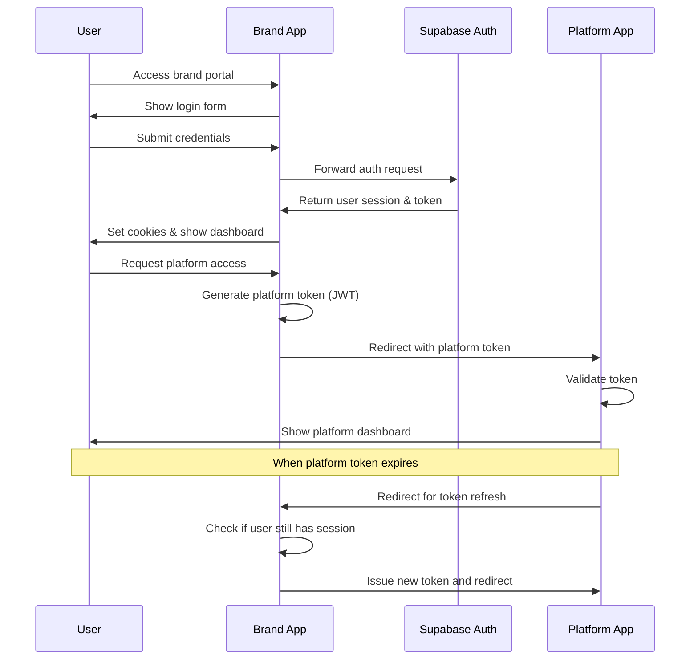
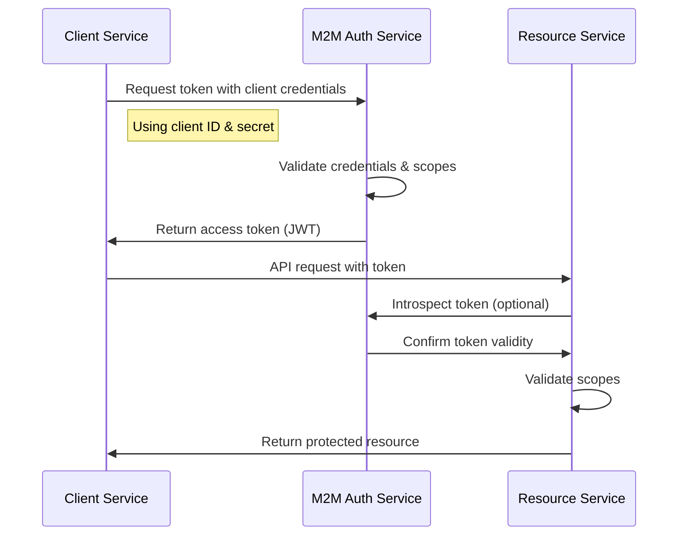

# Brand-Platform Authentication Flows

This document provides a detailed overview of both authentication flows in the Brand-Platform system: the user authentication flow and the machine-to-machine (M2M) authentication flow.

## System Architecture

The authentication system consists of the following components:

```
+------------------------+      +------------------------+      +-----------------------+
|   Brand Application    |      |  Platform Application  |      |     Mock Services     |
| (User Authentication)  |<---->| (Token Validation)     |<---->| (Protected Resources) |
+------------------------+      +------------------------+      +-----------------------+
          ^                               ^                              ^
          |                               |                              |
          v                               v                              v
+------------------------+      +------------------------+      +-----------------------+
|    Supabase Auth       |      |     M2M Auth Service   |      |    Client Services   |
| (Identity Management)  |      | (Client Credentials)   |<---->| (Service Consumers)  |
+------------------------+      +------------------------+      +-----------------------+
```

## Authentication Flows

### 1. User Authentication Flow

The user authentication flow is designed for interactive web applications and implements a JWT-based Single Sign-On (SSO) system:



Key characteristics:
- Uses Supabase Auth for user identity
- JWT-based tokens signed with RSA keys
- Short-lived tokens with refresh mechanism
- Session management with cookies
- Designed for browser-based applications

### 2. Machine-to-Machine (M2M) Authentication Flow

The M2M authentication flow implements the OAuth 2.0 Client Credentials Flow for service-to-service communication:



Key characteristics:
- OAuth 2.0 Client Credentials Flow (RFC 6749)
- Client registration and secret management
- Scope-based access control
- Token introspection for validation
- Non-interactive, server-to-server communication

## Token Formats

### User Authentication Token

```json
{
  "alg": "RS256",
  "typ": "JWT"
}
.
{
  "sub": "user-uuid",
  "brand_id": "brand-portal",
  "platform_id": "trading",
  "permissions": ["trading", "view_history"],
  "wallet_id": "wallet-uuid",
  "exp": 1620000300,
  "iat": 1619999700,
  "aud": "platform-service",
  "nonce": "random-nonce-value",
  "jti": "unique-token-id"
}
```

### M2M Authentication Token

```json
{
  "alg": "RS256",
  "typ": "JWT"
}
.
{
  "iss": "brand-platform-m2m",
  "sub": "client-uuid",
  "aud": "api",
  "client_id": "client-uuid",
  "client_name": "Example Service",
  "scope": "read write trading",
  "exp": 1619999700,
  "iat": 1619996100,
  "jti": "unique-token-id",
  "nonce": "random-nonce-value"
}
```

## Shared Infrastructure

Both authentication flows share some common infrastructure:

1. **RSA Key Pair**
   - The same RSA keys are used for signing both user and M2M tokens
   - Private key for signing tokens, public key for verification

2. **JWT Format**
   - Both use JWTs with the RS256 algorithm
   - Similar structure (expiry, issuance, jti for tracking)

3. **Token Validation Logic**
   - Common validation checks (signature, expiry, revocation)

## Use Cases

### User Authentication Use Cases

1. **Brand Portal Access**
   - Users log in to the brand portal
   - Access is managed by Supabase Auth

2. **Platform SSO**
   - Users access trading platforms from the brand portal
   - Brand issues platform-specific tokens
   - Platform validates tokens and creates sessions

3. **Token Refresh**
   - When platform tokens expire, users are redirected back to brand
   - Brand app issues new tokens if the user session is still valid

### M2M Authentication Use Cases

1. **Service-to-Service API Calls**
   - Transaction service calling contract service
   - Trading service calling pricing service
   - KYC service accessing user data

2. **Automated Processes**
   - Batch processing between services
   - Scheduled tasks requiring service access
   - Event-driven workflows

3. **Platform Integration**
   - Internal services accessing external APIs
   - Platform backends accessing specialized services

## Testing the Authentication Flows

### Testing User Authentication

1. Access the Brand App at http://localhost:3000
2. Register a new user or log in
3. Request access to a trading platform
4. Observe the SSO redirect with token
5. Access the trading platform dashboard

### Testing M2M Authentication

1. Access the M2M Auth Demo at http://localhost:3003
2. Register a client and note the credentials
3. Request an access token using the client credentials
4. Use the token to access a protected service
5. Try token introspection and revocation

## Best Practices

1. **Token Lifetime Management**
   - Use short-lived tokens (15 minutes for user, 1 hour for M2M)
   - Implement proper token refresh mechanisms
   - Store token IDs for revocation capability

2. **Security Measures**
   - Keep private keys secure and rotate periodically
   - Use HTTPS for all communications
   - Implement rate limiting on token endpoints
   - Hash client secrets securely (SHA-256)

3. **Scope Management**
   - Limit scopes to the minimum required
   - Validate scopes on all protected resources
   - Document available scopes for developers