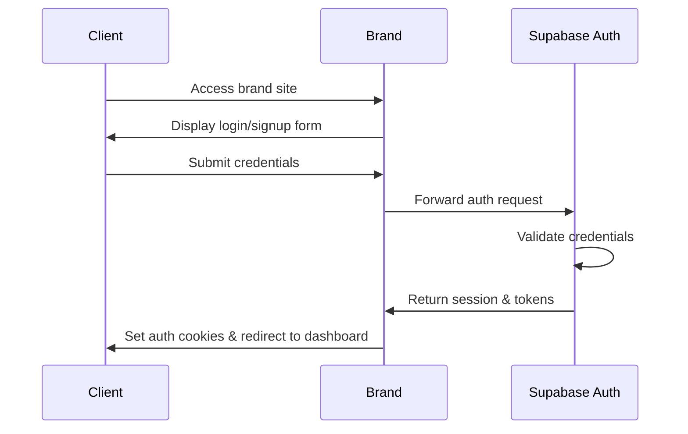
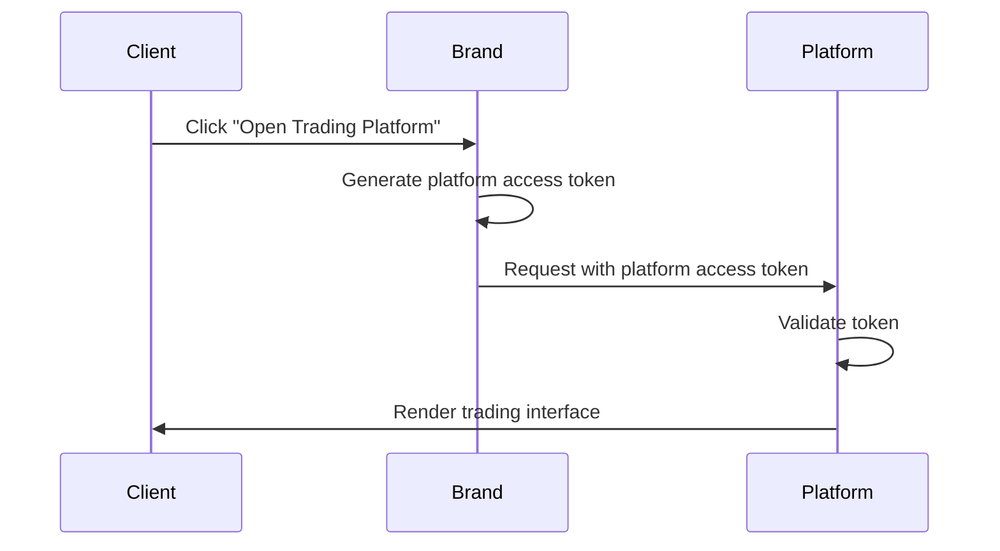
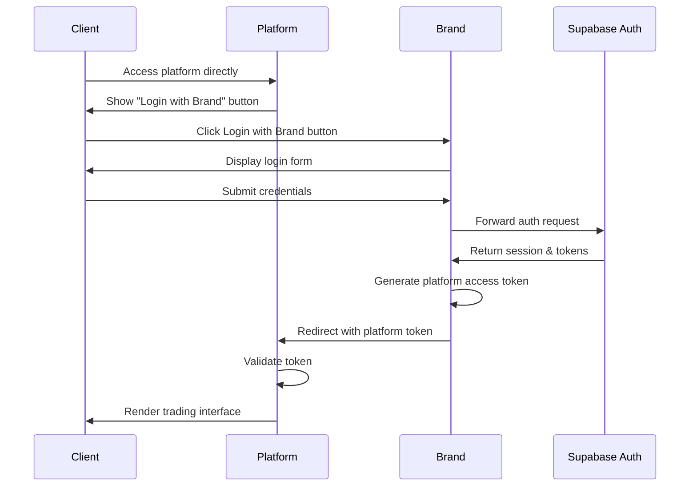
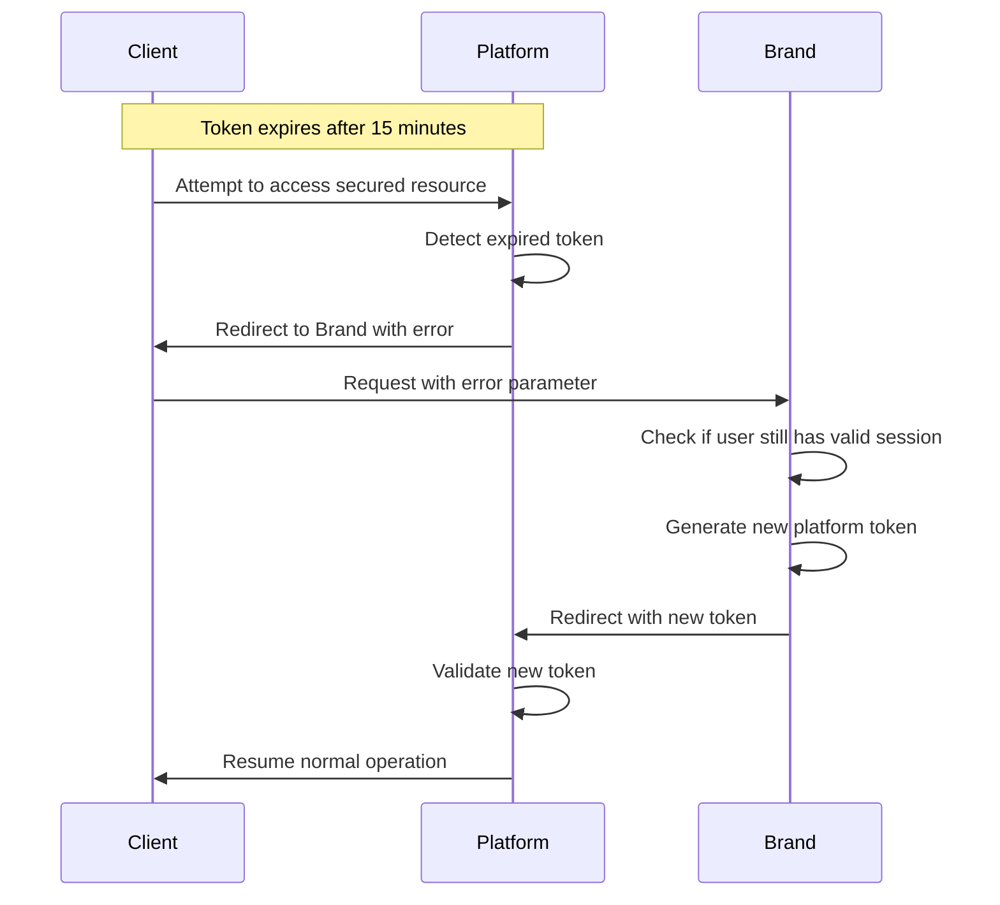
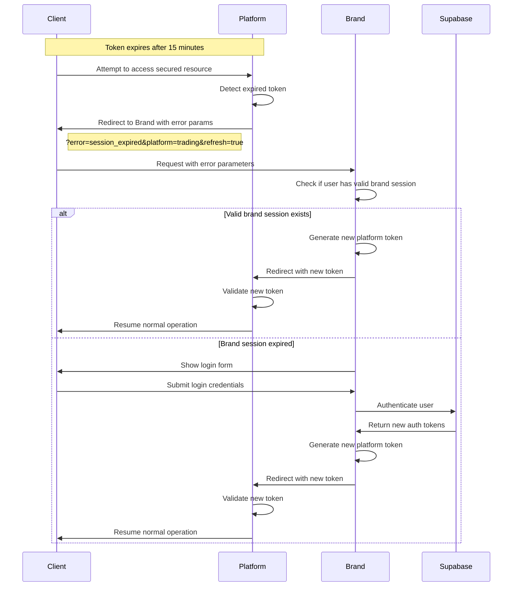
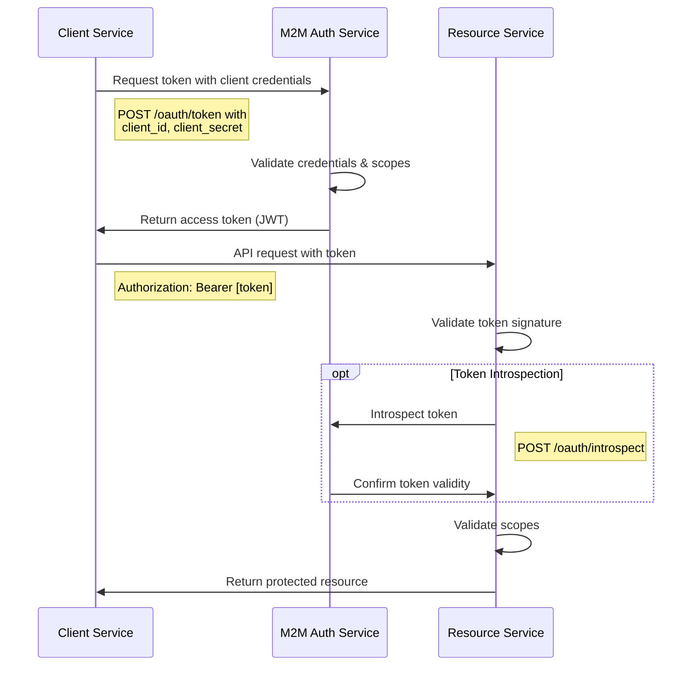
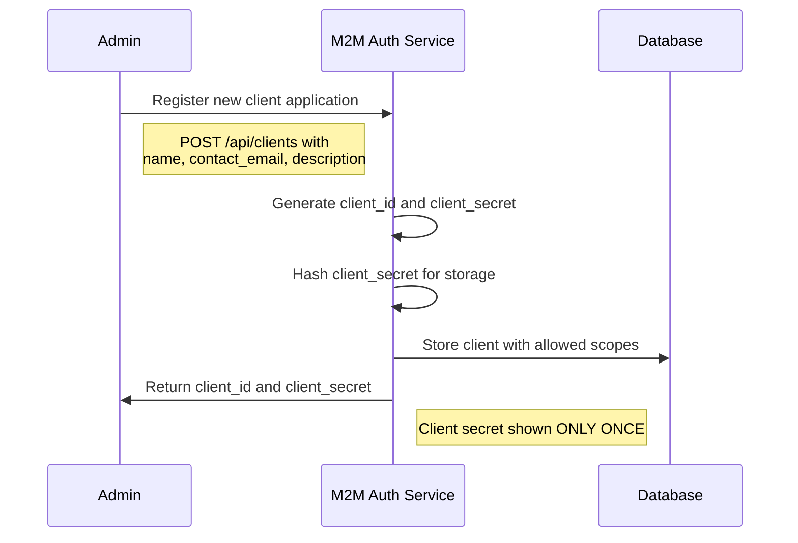
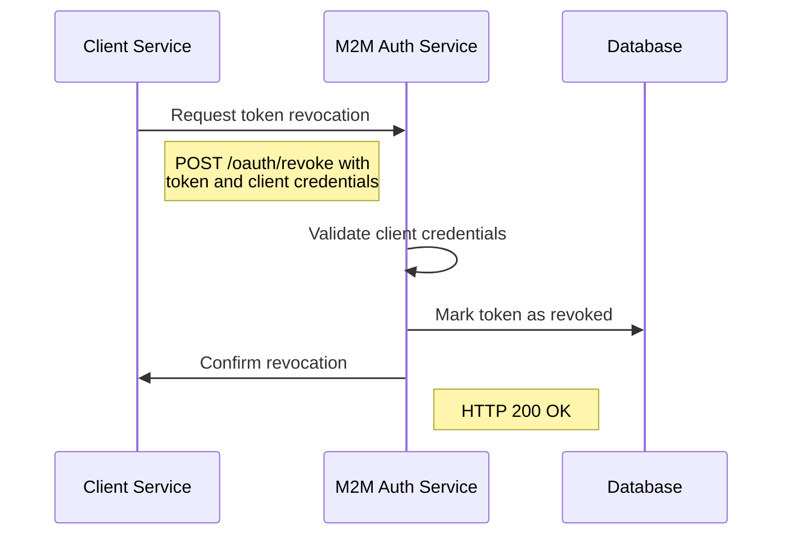

# Technical Specification: Brand-Platform Integration

## Overview

This document specifies the technical implementation for integrating brands with platforms using Supabase Auth for authentication and JWT tokens for authorization. The solution will be developed and tested in a local Docker environment.

## Table of Contents

1. [Architecture](#architecture)
2. [Components](#components)
3. [Authentication Flow](#authentication-flow)
4. [API Specifications](#api-specifications)
5. [JWT Token Structure](#jwt-token-structure)
6. [Docker Setup](#docker-setup)
7. [Security Considerations](#security-considerations)
8. [Testing Plan](#testing-plan)

## Architecture

The system consists of the following logical components:
- Brand Application (White Label)
- Platform Application
- Supabase Auth Service
- Shared Services (KYC, Wallet, etc.)

## Components

### Brand Application

**Purpose**: Serves as the white-label interface that clients interact with.

**Core Responsibilities**:
- User authentication via Supabase Auth
- User profile management
- Platform access management
- Token generation for SSO to platforms

**Tech Stack**:
- Frontend: React/Next.js
- Backend: Node.js/Express
- Database: PostgreSQL (via Supabase)
- Authentication: Supabase Auth

### Platform Application

**Purpose**: Provides trading functionality to authenticated users.

**Core Responsibilities**:
- Token validation
- Trading interface
- Market data handling
- Order management

**Tech Stack**:
- Frontend: React/Angular
- Backend: Node.js/Express
- Token Validation: JWT verification

### Supabase Auth Service

**Purpose**: Handles all authentication-related functionality.

**Core Capabilities**:
- User registration/login
- Email verification
- Password reset
- Session management
- JWT token issuance

### Shared Services

**Purpose**: Provides common functionality across brands and platforms.

**Services Include**:
- KYC verification
- Wallet management
- Compliance checks
- User profile storage

## Authentication Flows

The system implements two distinct authentication flows:

### 1. User Authentication Flow

The user authentication flow is designed for interactive web applications and implements a JWT-based Single Sign-On (SSO) system:



#### Platform Access (Already Authenticated)



#### Login via Platform (Direct Platform Access)



#### Token Expiration Handling



#### Token Refresh Flow (Detailed)



### 2. Machine-to-Machine (M2M) Authentication Flow

The M2M authentication flow implements the OAuth 2.0 Client Credentials Flow for service-to-service communication:



#### Client Registration Flow

Before a client can request tokens, it must be registered:



#### Token Revocation Flow



#### Token Refresh Flow Details

The refresh token flow is managed by the Brand Portal, which serves as the authentication authority:

1. **Token Lifetime Management**:
   - Platform access tokens have a 15-minute expiration by default
   - The brand app generates these tokens with the `generatePlatformAccessToken()` function
   - Tokens are signed using RSA256 with private keys stored in the brand app

2. **Expiration Detection**:
   - The platform app checks token expiration during validation
   - When a token expires, it returns a 401 error with "Token has expired" message
   - The platform then redirects to the brand app with specific URL parameters:
     ```
     ?error=session_expired&platform=trading&refresh=true
     ```

3. **Silent Refresh Process**:
   - The brand app's client-side code (in `main.js`) detects these parameters
   - It checks if the user still has a valid Supabase auth session locally
   - If valid, it silently generates a new platform token without requiring user interaction
   - If invalid, it shows the login form and then redirects back after successful authentication

4. **Separation of Responsibilities**:
   - **Platform responsibility**: Detect expired tokens, redirect to brand for refresh
   - **Brand responsibility**: Maintain user sessions, generate new tokens when needed
   - **User experience**: Seamless token refresh when possible, login prompt only when necessary

5. **Testing the Refresh Flow**:
   - Login to the brand portal and access the platform
   - To test manually, append `?error=session_expired&platform=trading&refresh=true` to the brand URL
   - For live testing, modify token expiration to a shorter period (e.g., 30 seconds)
   - Monitor network traffic in browser DevTools to observe the redirect chain

This approach maintains security while providing a smooth user experience by handling token refreshes seamlessly whenever possible.

## API Specifications

### Brand Authentication API

#### Register User

```
POST /auth/signup
```

**Request Body**:
```json
{
  "email": "user@example.com",
  "password": "securePassword123",
  "first_name": "John",
  "last_name": "Doe"
}
```

**Response (200 OK)**:
```json
{
  "user": {
    "id": "user-uuid",
    "email": "user@example.com",
    "first_name": "John",
    "last_name": "Doe"
  },
  "session": {
    "access_token": "eyJhbGciOiJIUzI1NiIsI...",
    "refresh_token": "eyJhbGciOiJIUzI1NiIsI...",
    "expires_at": 1620000000
  }
}
```

#### Login User

```
POST /auth/login
```

**Request Body**:
```json
{
  "email": "user@example.com",
  "password": "securePassword123"
}
```

**Response (200 OK)**:
```json
{
  "user": {
    "id": "user-uuid",
    "email": "user@example.com"
  },
  "session": {
    "access_token": "eyJhbGciOiJIUzI1NiIsI...",
    "refresh_token": "eyJhbGciOiJIUzI1NiIsI...",
    "expires_at": 1620000000
  }
}
```

### Platform Access API

#### Generate Platform Access Token

```
POST /platform/access-token
```

**Request Headers**:
```
Authorization: Bearer <supabase-auth-token>
```

**Request Body**:
```json
{
  "platform_id": "trading",
  "requested_scope": "trading"
}
```

**Response (200 OK)**:
```json
{
  "platform_access_token": "eyJhbGciOiJIUzI1NiIsI...",
  "expires_at": 1620000000
}
```

#### Access Platform With Token

```
GET /platform/access
```

**Request Parameters**:
```
token=eyJhbGciOiJIUzI1NiIsI...
```

**Response**: Redirects to platform with established session

## JWT Token Structure

### Supabase Auth Token

```json
{
  "alg": "HS256",
  "typ": "JWT"
}
.
{
  "sub": "user-uuid",
  "email": "user@example.com",
  "role": "authenticated",
  "exp": 1620000000,
  "iat": 1619990000,
  "aud": "brand-service"
}
```

### Platform Access Token

```json
{
  "alg": "RS256",
  "typ": "JWT"
}
.
{
  "sub": "user-uuid",
  "brand_id": "brand-portal",
  "platform_id": "trading",
  "permissions": ["trading", "view_history"],
  "wallet_id": "wallet-uuid",
  "exp": 1620000300,
  "iat": 1619999700,
  "aud": "platform-service",
  "nonce": "random-nonce-value",
  "jti": "unique-token-id"
}
```

## External Supabase Setup

### Supabase Architecture

Supabase is a fully-featured backend-as-a-service platform that our system depends on. It consists of the following key components:

1. **PostgreSQL**: The core database that stores all data.
2. **GoTrue**: Authentication and user management service.
3. **PostgREST**: Automatically generates RESTful API from PostgreSQL schema.
4. **Storage API**: Handles file storage and management.
5. **Realtime**: Enables real-time data subscriptions over WebSockets.
6. **Kong API Gateway**: Routes all external requests to the appropriate microservices.
7. **PostgreSQL Meta**: Database schema and management API.
8. **Studio**: Admin UI for managing Supabase services.
9. **Edge Runtime**: Serverless functions execution environment.

### Setting Up Supabase

For local development, we use the official Supabase Docker setup:

```bash
# Get the code
git clone --depth 1 https://github.com/supabase/supabase

# Go to the docker folder
cd supabase/docker

# Copy the fake env vars
cp .env.example .env

# For a development environment, enable email auto-confirmation by adding these settings to your Supabase .env file:
echo "
## Email auth
ENABLE_EMAIL_AUTOCONFIRM=true
GOTRUE_MAILER_AUTOCONFIRM=true" >> .env

# Pull the latest images
docker compose pull

# Start the services (in detached mode)
docker compose up -d
```

This will start a local Supabase instance with all necessary services running on:
- API Gateway: http://localhost:8000
- Studio UI: http://localhost:3500

The email auto-confirmation settings will bypass the email verification step and automatically confirm new users when they sign up, which is convenient for development.

## Security Considerations

### JWT Token Security

1. **Token Signing**:
   - Brand tokens use RS256 algorithm with public/private key pairs
   - Keys should be stored securely in environment variables or a vault service

2. **Token Claims**:
   - Include expiration (`exp`) with short lifespan (5-15 minutes)
   - Use audience (`aud`) claim to prevent token reuse
   - Include token ID (`jti`) for revocation capability
   - Use nonce values to prevent replay attacks

3. **Token Transmission**:
   - HTTPS for all communications
   - Avoid URL parameters for token transmission when possible
   - Use secure, httpOnly cookies for session management

### Brand Registration Security

1. **API Authentication**:
   - Use mutual TLS for service-to-service communication
   - Implement IP whitelisting for brand registration endpoints
   - Require admin authentication for brand registration

2. **Credential Management**:
   - Generate cryptographically secure client IDs
   - Store private keys in a secure key management service
   - Implement credential rotation policies

### Platform Access Security

1. **Request Validation**:
   - Validate JWT signature and claims
   - Check token expiration
   - Verify brand whitelist
   - Validate user permissions

2. **Rate Limiting**:
   - Implement per-brand and per-user rate limits
   - Add rate limiting headers to responses
   - Log and alert on abnormal request patterns

## Implementation Steps

1. **Set Up Local Environment**:
   - Set up Supabase with official Docker setup (external dependency)
   - Configure Docker Compose for application services
   - Set up development environment

2. **Implement Authentication**:
   - Set up Supabase Auth
   - Implement registration/login
   - Configure session management

3. **Implement Token Generation**:
   - Create JWT signing functionality
   - Implement token generation API
   - Add token validation middleware

4. **Develop Platform Access**:
   - Create platform access endpoint
   - Implement token validation
   - Set up session establishment

5. **Security Hardening**:
   - Add rate limiting
   - Implement IP whitelisting
   - Set up monitoring and logging

6. **Testing**:
   - Write and run unit tests
   - Perform integration testing
   - Complete E2E test scenarios

## Conclusion

This technical specification provides a comprehensive guide for implementing a secure and efficient brand-platform integration using Supabase Auth and JWT tokens. The Docker-based local development setup allows for rapid testing and iteration of the authentication flow before production deployment.
